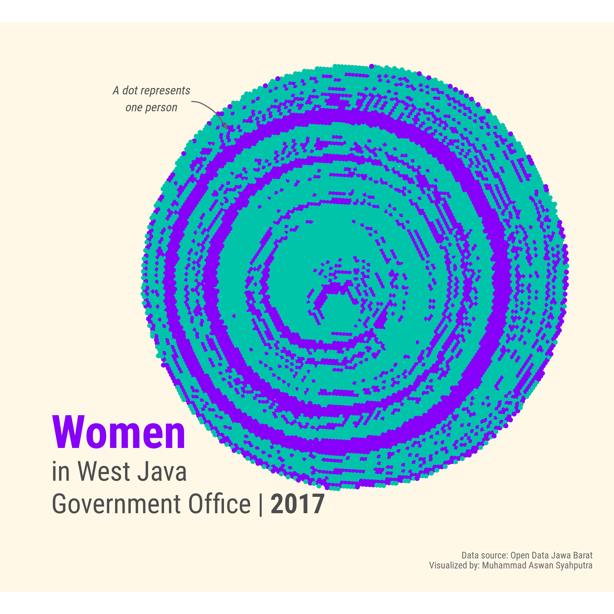
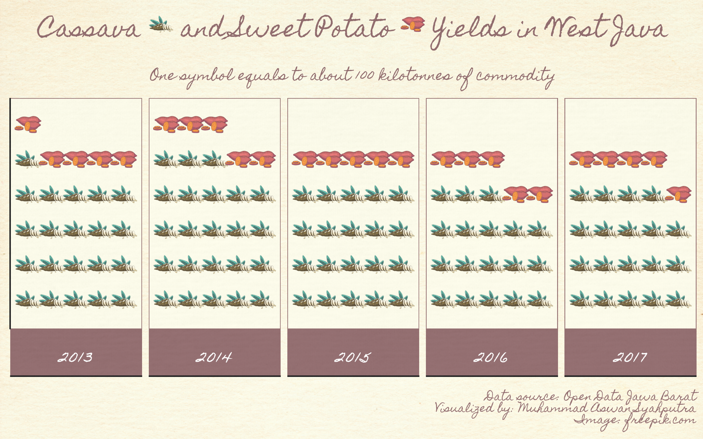
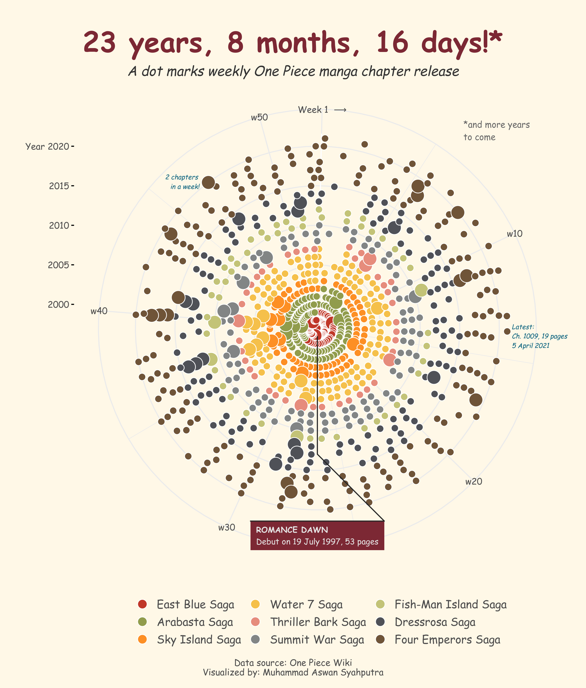
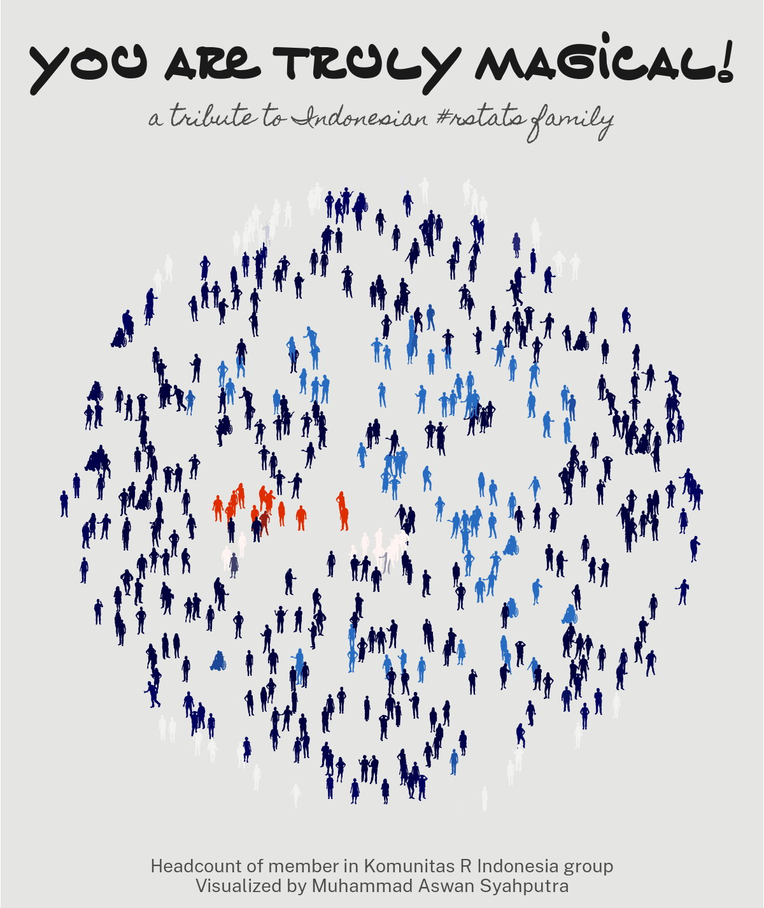
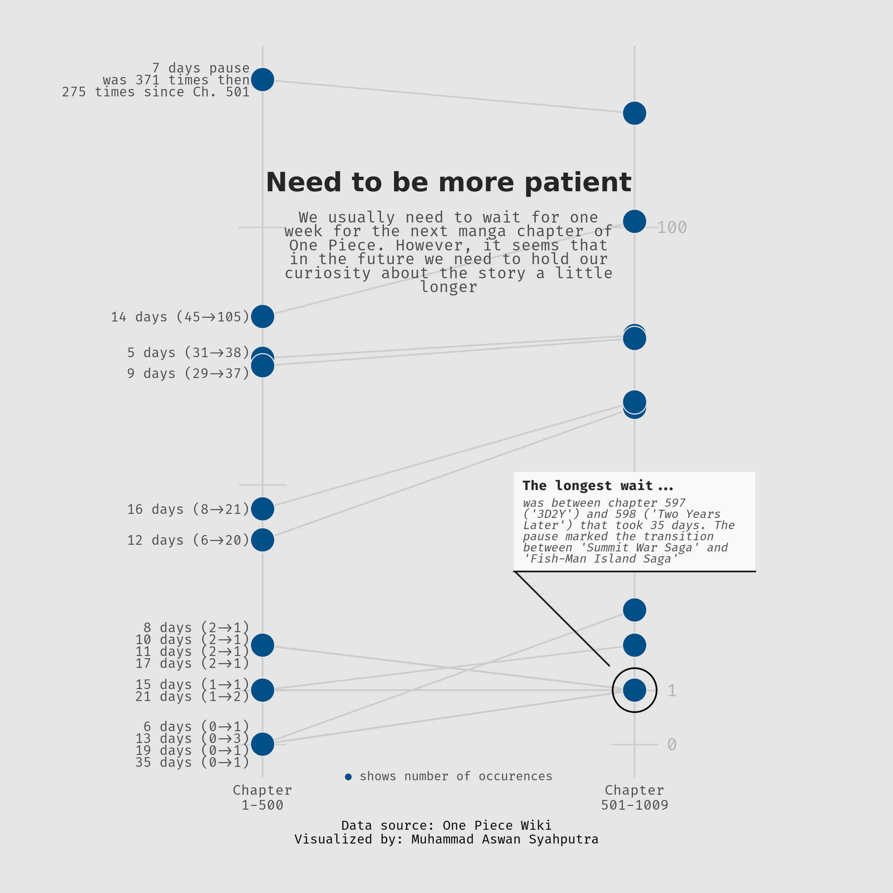
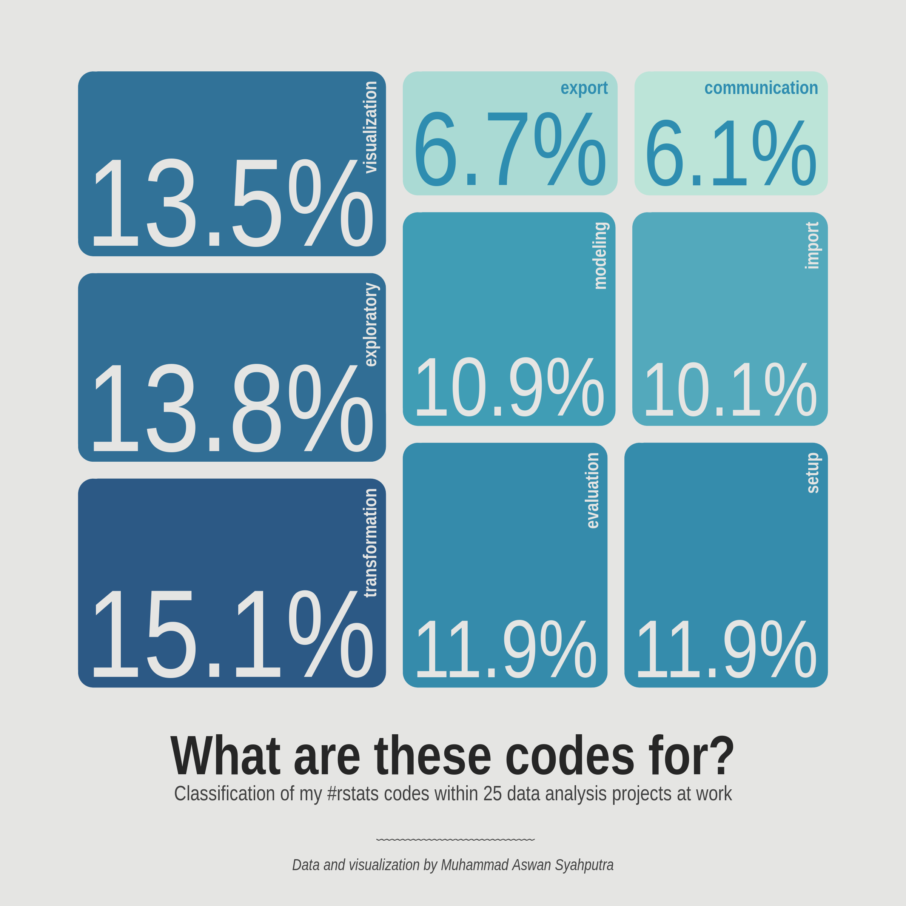
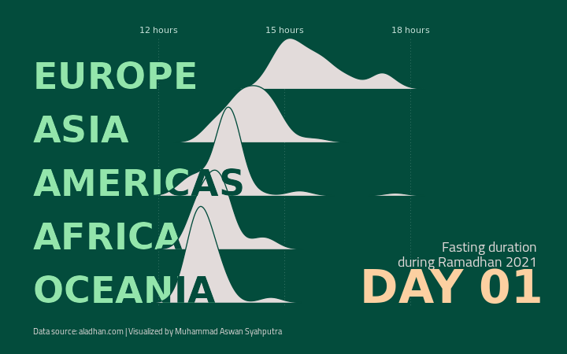
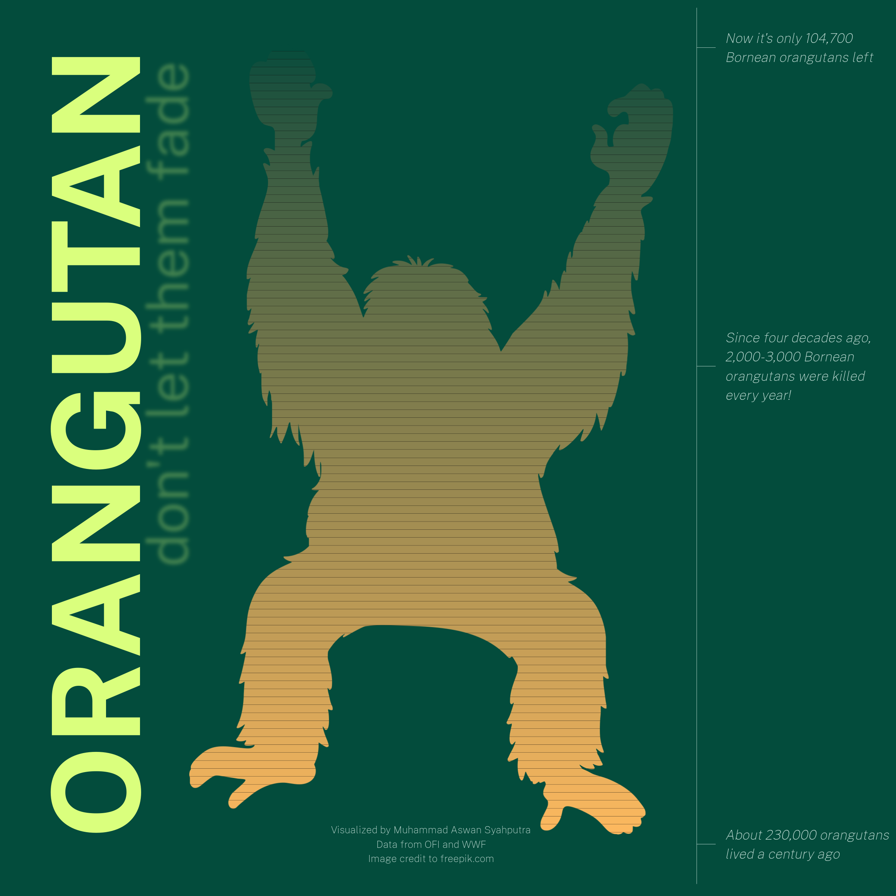
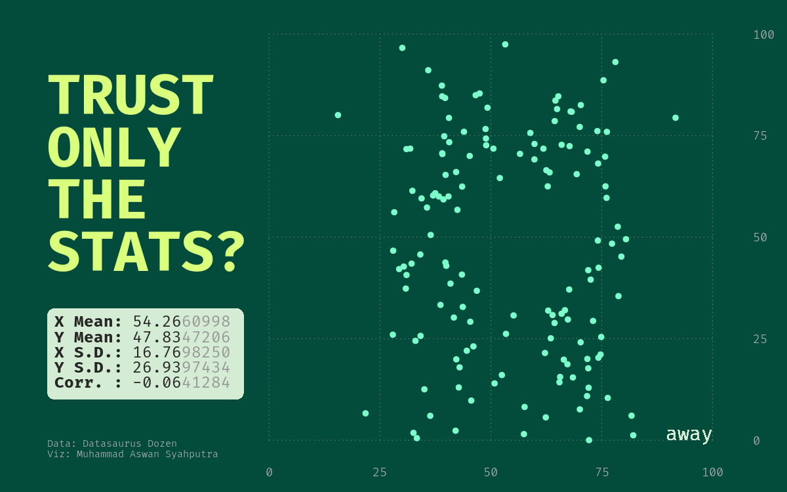

## 30 Days Chart Challenge

Compendium of my works for #30daychartchallenge. All was created using #rstats.

### [Day 1: Part-to whole](01-part_to_whole.R)

### [Day 2: Pictogram](02-pictogram.R)

### [Day 3: Historical](03-historical.R)

### [Day 4: Magical](04-magical.R)

### [Day 5: Slope](05-slope.R)

### [Day 6: Experimental](06-experimental.R)

### [Day 7: Physical](07-physical.R)

### [Day 8: Animals](08-animals.R)

### [Day 9: Statistics](09-statistics.R)

